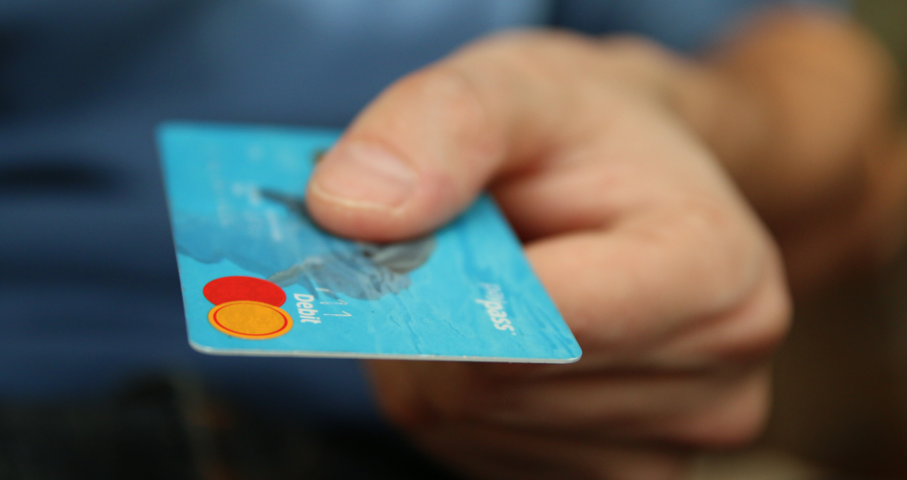

# Credit Card Fraud Detection

## Introduction

This is my certification project for the SE DP+ML specialization group training. 

The data used in this project is from Kaggle. Quoting from kaggle, “The datasets contains transactions made by credit cards in September 2013 by european cardholders. This dataset presents transactions that occurred in two days, where we have **492 frauds out of 284,807** transactions. The dataset is highly unbalanced, the positive class (frauds) account for 0.172% of all transactions.

The whole project consists of three parts:
* Part 1: Data Transformation             `cpart1.py` 
* Part 2: Data Analysis and Visualization `cpart2.py`
* Part 3: Machine Learning                `cpart3.py`

